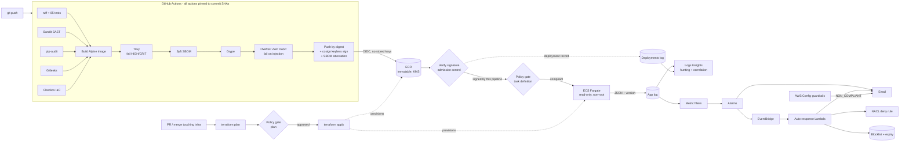

# 🔐 AWS AppSec Pipeline

[](https://github.com/eguidey/aws-pipeline-2/actions/workflows/pipeline.yml)


Most teams have a CI/CD pipeline and a SIEM, but the two don't talk. The pipeline knows *what* was deployed and what its scans found; the SIEM knows when something suspicious happens at runtime. Neither has the other's context.

This project connects them on AWS, end to end:

- **Shift left:** eight security gates (SAST, dependency CVEs, secrets, IaC, two container scanners, and DAST) before anything ships. Every image is **signed**, and deployment **refuses unsigned images**.
- **Shield right:** the API emits structured security telemetry; CloudWatch detects brute force, injection and abuse (mapped to MITRE ATT&CK).
- **The bridge:** every deployment is recorded with its commit, image digest, signature check, SBOM and scan results, and every runtime event carries the release version. So one query answers *"which release was live when this attack started, and what did its scans say?"*
- **Respond:** a Lambda automatically **blocks attacking IPs** at the network layer and emails the evidence.
- **Guardrails:** a policy gate *blocks* non-compliant plans and task definitions before they reach AWS, IAM denies lock every CI role to approved regions, and AWS Config continuously checks the live environment and alerts on drift.
- **Infrastructure as a pipeline:** Terraform itself runs in GitHub Actions: plan + policy gate on every pull request, approved apply on `main`.

---

## Architecture



---

## Pipeline stages

| # | Stage | Tool | Fails the build when... |
|---|---|---|---|
| 1 | Lint & tests | ruff, pytest (85 tests) | Code issue or failing test, including tests of the security controls, the responder and the policy gate |
| 2 | SAST | Bandit | Medium+ issue in the app or Lambda code |
| 3 | Dependencies | pip-audit | A pinned dependency has a known CVE |
| 4 | Secrets | Gitleaks | A credential appears anywhere in git history |
| 5 | IaC | `terraform fmt` + `terraform validate` + Checkov | Formatting, invalid Terraform, or misconfiguration (**299 Checkov checks passing** across 8 modules and the bootstrap stack, every exception documented) |
| 6 | Image scan | Trivy | Fixable HIGH/CRITICAL vulnerability |
| 7 | SBOM + second scan | Syft + Grype | *Recorded, not blocking*: a second vulnerability database, results saved with the deployment |
| 8 | DAST | OWASP ZAP API scan | SQLi, XSS, command injection, path traversal or code injection found against the running container |
| 9 | Sign | cosign (keyless, Sigstore) | Image and SBOM attestation signed with the workflow's OIDC identity; pushed **by digest** |
| 10 | Admission control | cosign verify | **Deploy refuses any image not signed by this exact workflow on `main`** |
| 11 | Policy gate | `policy/check.py` | The new task definition breaks a guardrail: wrong Fargate size, writable root, privileged, capabilities not dropped, image not from our ECR by digest |
| 12 | Deploy | ECS Fargate | Circuit breaker rolls back failed releases automatically |
| 13 | Record | CloudWatch | Deployment record (now including the policy result) written even when a deploy fails or is blocked |

**Supply chain:** after the March 2026 compromise of the `trivy-action` GitHub Action (attackers moved 76 of its 77 version tags to credential-stealing code), every third-party action here is pinned to a full commit SHA. Tags can be moved; SHAs can't. Dependabot still proposes updates.

---

## Runtime detections & automated response

| Detection | Trigger | MITRE ATT&CK | Automated response |
|---|---|---|---|
| `brute_force` | 5+ failed logins from one IP in 5 min | T1110 | **Block source IP** (NACL deny) |
| `auth_failure_spike` | 10+ failed logins overall in 5 min | T1110.003 | Alert |
| `injection_attempt` | SQLi / XSS / traversal / command-injection signature | T1190 | **Block source IP** |
| `rate_limited` | 20+ throttled requests in 5 min | T1499 | Alert |
| `server_errors` | 5+ HTTP 5xx in 5 min | Exploitation / fault | Alert |

**How the responder works:** the alarm fires, EventBridge invokes the Lambda, and the Lambda runs a Logs Insights query to find the offending source IPs. It skips private, reserved and never-block addresses, adds a network ACL **deny** rule for each offender (NACLs support explicit deny; security groups don't), records the block in DynamoDB with an expiry, and emails an evidence summary. A scheduled run removes blocks after `block_minutes`. `auto_response_mode = "notify"` switches it to dry-run.

**Hunting & correlation queries** (CloudWatch → Logs Insights → Saved queries):
- `top_source_ips`, `failed_logins_by_source`, `injection_attempts`, `successful_login_after_failures`, `errors_and_slow_requests`
- `correlation/deployment_timeline`: releases and attacks on one timeline
- `correlation/attacks_by_release`: security events grouped by the release that was running
- `correlation/release_scan_history`: every deployment with its signature, SBOM and scan results

---

## Infrastructure pipeline (`infra.yml`)

Terraform runs in its own workflow, triggered only by changes under `infra/`, `policy/`, `detections/` or `lambda/`:

| Event | Role (OIDC) | What runs |
|---|---|---|
| Pull request | `terraform-plan` (read-only) | `terraform plan` → policy gate; the PR fails on any violation |
| Merge to `main` | `terraform-apply`, only from the protected `infrastructure` environment | plan → policy gate → **human approval** → apply exactly that plan |

Both roles live in the **bootstrap** stack with the state bucket and the GitHub OIDC provider, so `terraform destroy` on the app can never delete the pipeline's own identity. The apply role has admin rights (Terraform creates IAM roles and KMS keys), but explicit denies override them. It cannot:
- act outside the approved regions
- create IAM users or access keys
- modify or lend out the pipeline roles or the OIDC provider
- weaken the state bucket

On a fresh environment, run this workflow before the app pipeline.

## Preventive guardrails (policy as code)

`policy/rules.json` is the single source of truth. Four enforcement points read it:

| Where | When | Blocks |
|---|---|---|
| Terraform variable validation | `plan` | Regions outside `allowed_regions`, unknown environments, invalid or oversized Fargate CPU/memory pairs |
| Plan gate (`policy/check.py plan`) | Before every apply | ECR without immutable tags / scan-on-push / KMS; unencrypted log groups; SSH/RDP open to the internet; incomplete S3 public-access blocks; IAM users or access keys; container hardening removed from the task definition |
| Deploy gate (`policy/check.py taskdef`) | Before a task definition is registered | The same container hardening, plus the image must come from this ECR repository pinned by digest |
| IAM explicit deny | Every API call by the CI roles | Any action outside `allowed_regions` |

AWS Config (below) then covers anything changed outside the pipelines.

## Cloud guardrails (AWS Config)

Continuously evaluated against the live account, with an email on any `NON_COMPLIANT` result: ECR scanning on, ECR tags immutable, containers read-only and non-privileged, log groups encrypted, VPC flow logs on, default security group closed, no open SSH, **root MFA enabled**, no root access keys.

---

## Security controls

| Layer | Controls |
|---|---|
| **Application** | Allow-list validation · URL-decoding before signature matching (catches encoded/double-encoded payloads) · rate limiting · brute-force tracking · constant-time password comparison · no user enumeration · 16 KB body limit · no stack traces to clients · secret redaction in logs · OWASP headers · hidden server banner · release version on every event |
| **Container** | Multi-stage Alpine · non-root · `pip` removed · OS packages patched at build · read-only root FS · all capabilities dropped · deployed by immutable digest |
| **Supply chain** | SHA-pinned actions · SBOM (SPDX) · two scanners · keyless signing + signature verification before deploy · Dependabot for pip, Docker, Actions and Terraform |
| **AWS** | Least-privilege IAM (the app has **zero** AWS permissions) · OIDC trust scoped to branch/environment and GitHub's immutable subject claims · KMS everywhere · Secrets Manager · VPC flow logs · locked default SG · budget alerts · AWS Config guardrails |
| **Infrastructure code** | 8 single-purpose Terraform modules · prod/dev environments with separate state · state in versioned, encrypted S3 with native locking, in its own bootstrap stack · Terraform run by GitHub Actions with a read-only plan role and an approval-gated apply role · policy gate on every plan · input validation from `policy/rules.json` · email/IP marked sensitive so public logs never show them |

---

## Repository layout

```
app/                     Flask API: routes, JSON logging, security controls
lambda/auto_response/    Automated incident response (block + expire + notify)
policy/                  rules.json + check.py: preventive guardrails (plan-time and deploy-time)
tests/                   85 pytest tests (API, security controls, responder, policy gate)
dast/                    OpenAPI contract + ZAP rules for the DAST gate
detections/              Hunting queries; correlation/ spans deployments + runtime
infra/main.tf            Root: composes the modules into one environment
infra/modules/           kms · network · registry · app_service · detection · cicd_identity · response · guardrails
infra/environments/      prod/dev settings + per-environment state backends
infra/bootstrap/         One-time stack: state bucket, GitHub OIDC provider, Terraform CI roles
.github/workflows/       pipeline.yml (app: gates, sign, deploy) · infra.yml (Terraform: plan, gate, apply)
scripts/simulate_attacks.py   Attack simulator to validate detections and response
docs/SETUP.md
```

## Quick start (local)

```bash
python -m venv .venv && source .venv/bin/activate      # Windows: .venv\Scripts\activate
pip install -r requirements.txt -r requirements-dev.txt
pytest -v
APP_DEMO_PASSWORD='Local-Pass-123!' gunicorn --config gunicorn.conf.py wsgi:app
python scripts/simulate_attacks.py http://127.0.0.1:8000
```

Deploy to AWS: **[docs/SETUP.md](docs/SETUP.md)**. This project can run in the same AWS account as the original `aws-appsec-pipeline` deployment; see *Running alongside the original deployment* in SETUP.md.

**Cost:** built for Free Tier credits. No NAT or load balancer. Roughly: KMS $1/mo, secret $0.40/mo, Fargate + public IP about $0.40/day while running, AWS Config and Lambda a few cents. A $10 budget alert is created automatically.

---

## Design decisions & trade-offs

- **No load balancer:** an ALB costs about $16/month. In production: ALB + AWS WAF + HTTPS with tasks in private subnets. The WAF would then do edge blocking and the responder would update a WAF IP set instead of a NACL.
- **Grype is recorded, not blocking:** two scanners with different databases disagree on edge cases; Trivy is the gate, Grype adds evidence to the deployment record.
- **NACL for blocking:** security groups can't express "deny"; NACLs can, with rules evaluated in order before the allow-all.
- **Scoped AWS Config recording:** only the resource types the rules evaluate, to keep cost near zero.
- **Modules with narrow interfaces:** each module owns one concern and receives only the ARNs it needs (e.g. the responder gets one NACL and one log group), which keeps IAM scoping obvious and makes each module reusable across environments.

## Azure → AWS mapping

This project implements the same design as [azure-appsec-pipeline](https://github.com/ArtistYay/azure-appsec-pipeline) on AWS:

| Azure version (built or planned) | This project |
|---|---|
| Flask `/health` with structured JSON logs to stdout | Flask API with JSON security telemetry, release version on every event |
| Alpine image, layer caching, Gunicorn | Multi-stage Alpine, non-root, Gunicorn, read-only root FS |
| Terraform modules: network, storage, compute, identity, policy | 8 modules: network, registry, app_service, cicd_identity, guardrails, kms, detection, response |
| VNet + subnet + NSG (Container App not yet VNet-integrated) | VPC + subnets + security group + NACL, **with** the Fargate tasks running inside them |
| ACR | ECR: immutable tags, scan on push, KMS |
| Container Apps + Log Analytics | ECS Fargate + CloudWatch Logs (KMS-encrypted) |
| User-assigned identity with `AcrPull` only | Task execution role limited to pulling this one ECR repo; the app itself has zero AWS permissions |
| Azure Policy (deny): allowed locations | `policy/rules.json` → variable validation + plan gate + IAM region deny on every CI role |
| Azure Policy (deny): ACR SKU per environment | ECR has no tiers; the controls a premium registry adds (scanning, immutability, encryption) are always on and enforced by the plan gate |
| Azure Policy (deny): container CPU/memory ratio | Fargate size rules enforced at variable validation, plan gate and deploy gate |
| Terraform variable validation (location, env, CPU/memory, role) | Validation for region, environment, Fargate size, project name, email, response mode |
| OIDC federated credential scoped to repo + branch | OIDC roles scoped to branch/environment, including GitHub's immutable ID-based subjects |
| Identity bootstrapped outside Terraform so destroy can't remove it | `infra/bootstrap` owns the OIDC provider, Terraform CI roles and state bucket |
| Remote state in Blob Storage with lease locking | S3 with versioning, KMS, TLS-only policy and native lockfile |
| `terraform.yml` (path-filtered) + `app-deploy.yml` | `infra.yml` (path-filtered, plan on PR, approved apply) + `pipeline.yml` |
| Bandit, Checkov, Gitleaks, Grype, Dependabot | All five, plus ruff/pytest, pip-audit, Trivy, Syft SBOM, OWASP ZAP, cosign signing + verification |
| Flask → Azure Monitor → Sentinel; pipeline events in the same SIEM | App and deployment logs in CloudWatch, correlated in Logs Insights, with alarms mapped to MITRE ATT&CK |
| *(not in the Azure plan)* | Automated response Lambda, AWS Config drift detection, budget alerts, optional GuardDuty |

## Roadmap

- [ ] ALB + AWS WAF + HTTPS (ACM), tasks in private subnets
- [ ] Forward findings to AWS Security Hub
- [ ] Pin the ZAP container image by digest

---

Built by **Ian Guidry** · [ianguidry.com](https://ianguidry.com) · [LinkedIn](https://www.linkedin.com/in/ian-guidry-5823ab25b/)
